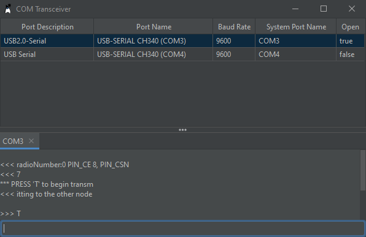

# Serial Port Transceiver

> This project serves as a proof of concept and as an entry level project for people who want to try to develop their own desktop application for communication over the serial port. 

The main feature of this application is the connection to and communication with multiple microcontrollers.

# Screenshots

## Special thanks to

* [Jannis Weis](https://github.com/weisJ) for putting so much effort and time into the development of [darklaf](https://github.com/weisJ/darklaf), a theme-based swing look and feel with many additional features that make it really pleasant to create some swing UIs again.
* The contributors and creators of [jSerialComm](https://github.com/Fazecast/jSerialComm), who created a great Java library for platform independent access to serial ports.